# Exno:1 Data Cleaning Process
# AIM
To read the given data and perform data cleaning and save the cleaned data to a file.
# Explanation
Data cleaning is the process of preparing data for analysis by removing or modifying data that is incorrect ,incompleted , irrelevant , duplicated or improperly formatted. Data cleaning is not simply about erasing data ,but rather finding a way to maximize datasets accuracy without necessarily deleting the information.
# Algorithm
STEP 1: Read the given Data

STEP 2: Get the information about the data

STEP 3: Remove the null values from the data

STEP 4: Save the Clean data to the file

STEP 5: Remove outliers using IQR

STEP 6: Use zscore of to remove outliers
# Program:
```python
import pandas as pd

#READ CSV FILE HERE
df=pd.read_csv("/DS INPUT - Sheet1.csv")
#DISPLAY THE INFORMATION ABOUT CSV AND RUN THE BASIC DATA ANALYSIS FUNCTIONS
df.head()
df.tail()
df.describe()
df.info()
#CHECK OUT NULL VALUES IN DATA SET USING FUNCTION
df.isnull()
#DISPLAY THE SUM ON NULL VALUES IN EACH ROWS
df.isnull().sum()
#DROP NULL VALUES
df.dropna()
#FILL NULL VALUES WITH CONSTANT VALUE "O"
df['TOTAL'].fillna(value=0)
#FILL NULL VALUES WITH ffill or bfill METHOD
df.fillna(method='ffill')
#CALCULATE MEAN VALUE OF A COLUMN AND FILL IT WITH NULL VALUES
df['TOTAL'].fillna(value=df['TOTAL'].mean())
#DROP NULL VALUES
df.dropna(axis=1)

import pandas as pd
import seaborn as sns

age=[1,3,28,27,25,92,30,39,40,50,26,24,29,94]
af=pd.DataFrame(age)
af

#USE BOXPLOT FUNCTION HERE TO DETECT OUTLIER
sns.boxplot(data=af)
#PERFORM IQR METHOD AND DETECT OUTLIER VALUES
q1=np.percentile(af,25)
q2=np.percentile(af,50)
q3=np.percentile(af,75)
IQR=q3-q1
lower_bound=q1 - 1.5 * IQR
upper_bound=q3 + 1.5 * IQR
outliers=[x for x in age if x < lower_bound or x > upper_bound]
#REMOVE OUTLIERS
aq=af[(af>=lower_bound)&(af<=upper_bound)]
aq.dropna()
#USE BOXPLOT FUNCTION HERE TO CHECK OUTLIER IS REMOVED
sns.boxplot(data=aq)

from scipy import stats #STATS METHOD IS USED TO IMPLEMENT Z SCORE METHOD

data=[1,12,15,18,21,24,27,30,33,36,39,42,45,48,51,54,57,60,63,66,69,72,75,78,81,84,87,90,93,96,99,158]
df=pd.DataFrame(data)

#USE BOXPLOT FUNCTION HERE TO DETECT OUTLIER
sns.boxplot(data=df)
#PERFORM Z SCORE METHOD AND DETECT OUTLIER VALUES
z=np.abs(stats.zscore(df))
print(df[z['weight']>3])
#REMOVE OUTLIERS
z.dropna()
#USE BOXPLOT FUNCTION HERE TO CHECK OUTLIER IS REMOVED
sns.boxplot(data=df)
```
# Output:
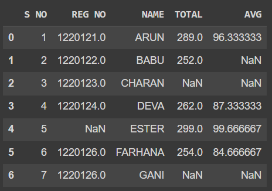
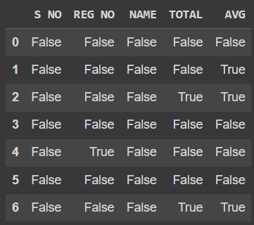
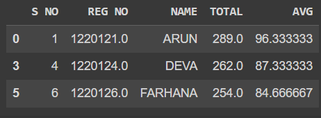
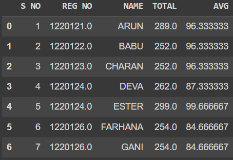
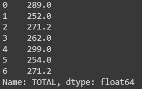
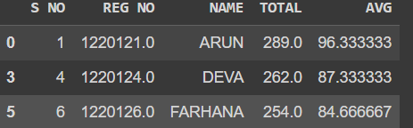
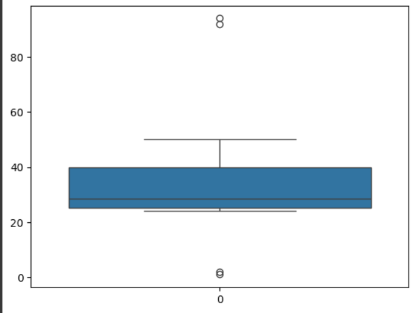
<br>
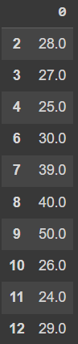<br>
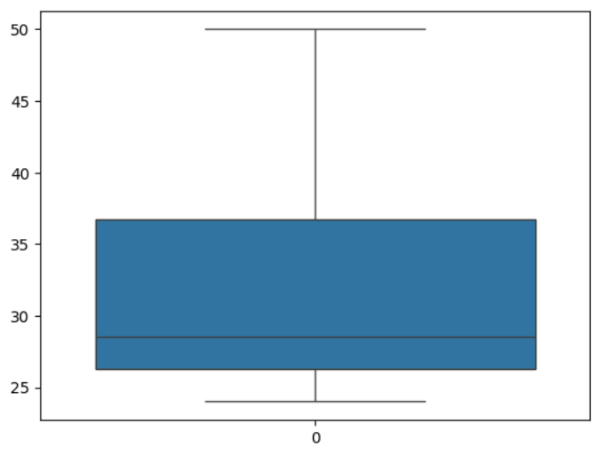<br>

<br>
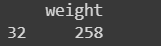
<br>
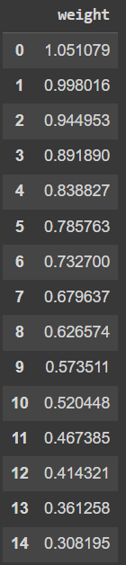

# Result
    Thus the Data Cleaning process is performed successfully!
